# Library Spring MVC application - example implementation for OAuth2 authentication

This is a simple library management system implemented using Spring MVC, Spring Security, and OAuth2.
It provides a web interface with user authentication and authorization using OAuth2.
Project is divided into three modules:

- library-commons - common classes and models
- library-backend - backend service configured as OAuth2 resource server
- library-frontend - frontend web application configured as OAuth2 client

Project uses Keycloak as OAuth2 provider and MySQL as database which will be started using Docker Compose.

## Project Structure

| Module               | Description                                             |
|----------------------|---------------------------------------------------------|
| **library-commons**  | Shared domain classes, DTOs, and utilities              |
| **library-backend**  | backend service acting as an OAuth2 resource server     |
| **library-frontend** | MVC frontend web application acting as an OAuth2 client | |

## Components

| Layer                             | Component                                   | Purpose                                                           |
|-----------------------------------|---------------------------------------------|-------------------------------------------------------------------|
| **Frontend (`library-frontend`)** | Spring Boot MVC + Thymeleaf + OAuth2 Client | Authenticates user via OIDC,  calls backend with Bearer Token |
| **Backend (`library-backend`)**   | Spring Boot Resource Server                 | Validates JWT (Access Token),  valididate Signatur über JWKS  |
| **Authorization Server (Docker)** | Keycloak                                    | Executes user login, provides tokens and public keys via JWKS     |
| **Database (Docker)**             | MySQL                                       | Stores library and Keycloak data                                  |
| **User (Browser)**                | Webbrowser                                  | Access to protected data                                          |

## Core Spring Components per Module

| Module               | Layer / Area             | Key Classes / Beans                                                                                                                                                   | Purpose                                                                         |
|----------------------|--------------------------|-----------------------------------------------------------------------------------------------------------------------------------------------------------------------|---------------------------------------------------------------------------------|
| **library-frontend** | **Security**             | `SecurityFilterChain` (with `.oauth2Login()`) `ClientRegistrationRepository` `OAuth2AuthorizedClientService` `AuthenticationPrincipal`                       | Handles OIDC login, stores tokens, and manages the `SecurityContext`            |
|                      | **Web / Controller**     | `@Controller`, `@GetMapping`, `Model` `ThymeleafViewResolver`                                                                                                      | Renders HTML UI with Thymeleaf and provides routes such as `/books`, `/login`   |
|                      | **Service / API Calls**  | `RestTemplate` or `WebClient` (with `ServerOAuth2AuthorizedClientExchangeFilterFunction`)                                                                             | Invokes the `library-backend` REST endpoints using Bearer Tokens                |
|                      | **Configuration**        | `application.yml` with `spring.security.oauth2.client.registration.*`                                                                                                 | Defines Client ID, Secret, Scopes, Redirect URI, and provider endpoints         |
| **library-backend**  | **Security**             | `SecurityFilterChain` (with `.oauth2ResourceServer().jwt()`) `JwtDecoder` (`NimbusJwtDecoder`) `JwtAuthenticationConverter` `JwtGrantedAuthoritiesConverter` | Validates JWTs, checks signatures, and converts claims into granted authorities |
|                      | **Web / REST API**       | `@RestController`, `@GetMapping`, `ResponseEntity`                                                                                                                    | Exposes protected REST endpoints (e.g. `/api/books`, `/api/users`)              |
|                      | **Data / Service Layer** | `@Service`, `@Repository`, JPA entities                                                                                                                               | Business logic, database access, and persistence                                |
|                      | **Configuration**        | `application.yml` with `spring.security.oauth2.resourceserver.jwt.jwk-set-uri`                                                                                        | Defines JWKS URI and other security properties                                  |

## Architecture / Flow Diagram

```mermaid
flowchart TB
%% --- FRONTEND ---
    subgraph FRONTEND["💻 library-frontend (Spring Boot App – OAuth2 Client + Web UI)"]
        F1["@SpringBootApplication"]
        F2["SecurityFilterChain + oauth2Login()"]
        F3["Thymeleaf Web UI (Renders HTML pages)"]
        F4["RestTemplate (with Bearer Token)"]
        F5["ClientRegistrationRepository (OIDC Provider configuration)"]
    end

%% --- BACKEND ---
    subgraph BACKEND["⚙️ library-backend (Spring Boot App – Resource Server)"]
        B1["@SpringBootApplication"]
        B2["SecurityFilterChain + oauth2ResourceServer().jwt()"]
        B3["JwtDecoder (NimbusJwtDecoder)"]
        B4["JwtAuthenticationConverter"]
        B5["/api/books, /api/users ..."]
    end

%% --- AUTH SERVER ---
    subgraph AUTH["🛡️ Authorization Server (Keycloak)"]
        A1["/authorize"]
        A2["/token"]
        A3["/.well-known/jwks.json"]
        A4["/userinfo"]
    end

%% --- USER ---
    subgraph USER["👤 User / Browser"]
        U1["Browser / Web Client"]
    end

%% --- FLOWS ---
    U1 -->|" 1️⃣ GET /books (protected) "| FRONTEND
    FRONTEND -->|" 2️⃣ Redirect to /authorize "| AUTH
    AUTH -->|" 3️⃣ Login / Credentials "| U1
    AUTH -->|" 4️⃣ Authorization Code "| FRONTEND
    FRONTEND -->|" 5️⃣ Changes Code for Token (/token) "| AUTH
    AUTH -->|" 6️⃣ ID + Access Token "| FRONTEND
    FRONTEND -->|" 7️⃣ Calls REST-API with Bearer Token "| BACKEND
    BACKEND -->|" 8️⃣ Validates signature via JWKS "| AUTH
    AUTH -->|" 9️⃣ /.well-known/jwks.json (Public Keys) "| BACKEND
    BACKEND -->|" 🔟 Provides JSON-Data (books, users) "| FRONTEND
    FRONTEND -->|" 🏁 Renders HTML (Thymeleaf) "| U1

%% --- STYLES ---
    classDef comp fill: #f6f8fa, stroke: #ccc, stroke-width: 1px, rx: 8px, ry: 8px;
    class FRONTEND,BACKEND,AUTH comp;
```

