# Library Spring MVC application - example implementation for OAuth2 authentication

This is a simple library management system implemented using Spring MVC, Spring Security, and OAuth2. 
It provides a web interface with user authentication and authorization using OAuth2.
Project is divided into three modules:
- library-commons - common classes and models
- library-backend - backend service configured as OAuth2 resource server
- library-frontend - frontend web application configured as OAuth2 client

Project uses Keycloak as OAuth2 provider and MySQL as database which will be started using Docker Compose.

## Komponenten
| Layer                               | Component                                   | Purpose                                                           |
|-----------------------------------|---------------------------------------------|-------------------------------------------------------------------|
| **Frontend (`library-frontend`)** | Spring Boot MVC + Thymeleaf + OAuth2 Client | Authenticates user via OIDC,  calls backend with Bearer Token |
| **Backend (`library-backend`)**   | Spring Boot Resource Server                 | Validates JWT (Access Token),  valididate Signatur über JWKS  |
| **Authorization Server**          | Keycloak                                    | Executes user login, provides tokens and public keys via JWKS     |
| **User (Browser)**                | Enduser / Webbrowser                        | Access to protected data                                          |

## Core Spring Components per Module
| Module                                | Layer / Area             | Key Classes / Beans                                                                                                                                                   | Purpose                                                                               |
| ------------------------------------- | ------------------------ | --------------------------------------------------------------------------------------------------------------------------------------------------------------------- | ------------------------------------------------------------------------------------- |
| **library-frontend**                  | **Security**             | `SecurityFilterChain` (with `.oauth2Login()`) `ClientRegistrationRepository` `OAuth2AuthorizedClientService` `AuthenticationPrincipal`                       | Handles OIDC login, stores tokens, and manages the `SecurityContext`                  |
|                                       | **Web / Controller**     | `@Controller`, `@GetMapping`, `Model` `ThymeleafViewResolver`                                                                                                      | Renders HTML UI with Thymeleaf and provides routes such as `/books`, `/login`         |
|                                       | **Service / API Calls**  | `RestTemplate` or `WebClient` (with `ServerOAuth2AuthorizedClientExchangeFilterFunction`)                                                                             | Invokes the `library-backend` REST endpoints using Bearer Tokens                      |
|                                       | **Configuration**        | `application.yml` with `spring.security.oauth2.client.registration.*`                                                                                                 | Defines Client ID, Secret, Scopes, Redirect URI, and provider endpoints               |
| **library-backend**                   | **Security**             | `SecurityFilterChain` (with `.oauth2ResourceServer().jwt()`) `JwtDecoder` (`NimbusJwtDecoder`) `JwtAuthenticationConverter` `JwtGrantedAuthoritiesConverter` | Validates JWTs, checks signatures, and converts claims into granted authorities       |
|                                       | **Web / REST API**       | `@RestController`, `@GetMapping`, `ResponseEntity`                                                                                                                    | Exposes protected REST endpoints (e.g. `/api/books`, `/api/users`)                    |
|                                       | **Data / Service Layer** | `@Service`, `@Repository`, JPA entities                                                                                                                               | Business logic, database access, and persistence                                      |
|                                       | **Configuration**        | `application.yml` with `spring.security.oauth2.resourceserver.jwt.jwk-set-uri`                                                                                        | Defines JWKS URI and other security properties                                        |
| **Authorization Server** *(external)* | —                        | Keycloak, Auth0, Azure AD, or Spring Authorization Server                                                                                                             | Performs user login, issues Access/ID Tokens, and publishes JWKS for token validation |

## Flow

```mermaid
flowchart LR
    %% --- FRONTEND ---
    subgraph FRONTEND["💻 library-frontend (Spring Boot App – OAuth2 Client + Web UI)"]
        F1["@SpringBootApplication"]
        F2["SecurityFilterChain + oauth2Login()"]
        F3["Thymeleaf Web UI (Rendert HTML-Seiten)"]
        F4["RestTemplate / WebClient (mit Bearer Token)"]
        F5["ClientRegistrationRepository (OIDC Provider Konfiguration)"]
    end

    %% --- BACKEND ---
    subgraph BACKEND["⚙️ library-backend (Spring Boot App – Resource Server)"]
        B1["@SpringBootApplication"]
        B2["SecurityFilterChain + oauth2ResourceServer().jwt()"]
        B3["JwtDecoder (NimbusJwtDecoder)"]
        B4["JwtAuthenticationConverter"]
        B5["/api/books, /api/users ..."]
    end

    %% --- AUTH SERVER ---
    subgraph AUTH["🛡️ Authorization Server (z. B. Keycloak / Auth0 / Azure AD)"]
        A1["/authorize"]
        A2["/token"]
        A3["/.well-known/jwks.json"]
        A4["/userinfo"]
    end

    %% --- USER ---
    subgraph USER["👤 Benutzer / Browser"]
        U1["Browser / Web Client"]
    end

    %% --- FLOWS ---
    U1 -->|"1️⃣ GET /books (geschützt)"| FRONTEND
    FRONTEND -->|"2️⃣ Redirect zu /authorize"| AUTH
    AUTH -->|"3️⃣ Login / Credentials"| U1
    AUTH -->|"4️⃣ Authorization Code"| FRONTEND
    FRONTEND -->|"5️⃣ Tauscht Code gegen Token (/token)"| AUTH
    AUTH -->|"6️⃣ ID + Access Token"| FRONTEND
    FRONTEND -->|"7️⃣ Ruft REST-API auf mit Bearer Token"| BACKEND
    BACKEND -->|"8️⃣ Prüft Signatur via JWKS"| AUTH
    AUTH -->|"9️⃣ /.well-known/jwks.json (Public Keys)"| BACKEND
    BACKEND -->|"🔟 Liefert JSON-Daten (z. B. Buchliste)"| FRONTEND
    FRONTEND -->|"🏁 Rendert HTML (Thymeleaf)"| U1

    %% --- STYLES ---
    classDef comp fill:#f6f8fa,stroke:#ccc,stroke-width:1px,rx:8px,ry:8px;
    class FRONTEND,BACKEND,AUTH comp;

```

## Architecture

```mermaid
flowchart LR
    %% ===== MODULES =====
    subgraph FRONTEND["💻 library-frontend (Spring Boot OAuth2 Client + Thymeleaf UI)"]
        FE1["OIDC Login (Authorization Code Flow)"]
        FE2["Thymeleaf Web UI"]
        FE3["RestTemplate / WebClient\n(mit Bearer Token)"]
    end

    subgraph BACKEND["⚙️ library-backend (Spring Boot Resource Server)"]
        BE1["JWT Validierung (NimbusJwtDecoder)"]
        BE2["Geschützte REST-Endpoints\n/api/books, /api/users"]
    end

    subgraph AUTH["🛡️ Authorization Server\n(z. B. Keycloak / Auth0 / Azure AD)"]
        AS1["/authorize"]
        AS2["/token"]
        AS3["/.well-known/jwks.json"]
    end

    subgraph USER["👤 Benutzer / Browser"]
        U1["Browser / Web Client"]
    end

    %% ===== CONNECTIONS =====
    U1 -->|"HTTP: GET /books"| FRONTEND
    FRONTEND -->|"OIDC Redirect: /authorize"| AUTH
    AUTH -->|"Authorization Code + Tokens"| FRONTEND
    FRONTEND -->|"REST-Call: GET /api/books\nAuthorization: Bearer <token>"| BACKEND
    BACKEND -->|"JWT Prüfung über JWKS"| AUTH
    BACKEND -->|"JSON Response (Bücher etc.)"| FRONTEND
    FRONTEND -->|"Rendert HTML (Thymeleaf)"| U1

    %% ===== STYLES =====
    classDef comp fill:#f6f8fa,stroke:#aaa,stroke-width:1px,rx:8px,ry:8px;
    class FRONTEND,BACKEND,AUTH comp;

```
